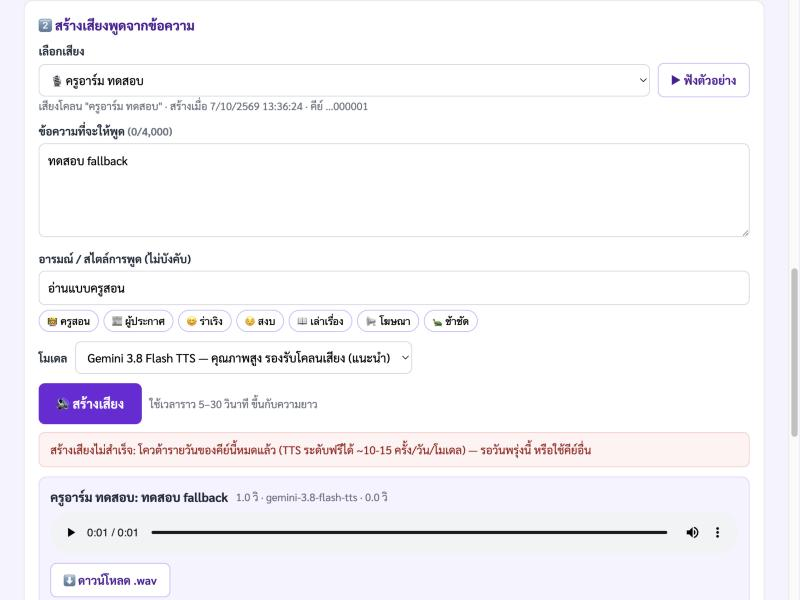

# NITED Voice Clone — โคลนเสียง + สร้างเสียงพูดด้วย Gemini 3.8 Flash TTS

เว็บแอปเล็ก ๆ สำหรับครู: **อัดเสียงตัวเอง 10–30 วินาที + อ่านประโยคยินยอม → ได้ "เสียงโคลน" (Voice Replication)**
แล้วพิมพ์ข้อความอะไรก็ได้ให้เสียงนั้นอ่าน · หรือเลือกใช้ **30 เสียงมาตรฐานของ Gemini** จาก dropdown · ดาวน์โหลดเป็น `.wav`

ใช้งานจริงใน **NITED AI Tools** ที่ https://dles.vec.go.th/voiceclone (ต้องล็อกอิน dles)



## ฟีเจอร์
- 🎤 **โคลนเสียง (Create Speaker)** — อัดจากไมค์ในเบราว์เซอร์ หรืออัปโหลดไฟล์ (.wav/.mp3/.m4a/.webm …)
  ระบบแปลงเป็น WAV 24kHz mono 16-bit ให้เองในเบราว์เซอร์ (ตัดให้ไม่เกิน 30 วิ) ก่อนส่งให้ Google
- 📜 **ประโยคยินยอม** ไทย / อังกฤษ / จีน (ตามที่ Google กำหนด — ต้องอ่านให้ตรงทุกคำ Google ตรวจว่าเป็นคนเดียวกับเสียงต้นแบบ)
- 🗣️ **ข้อความ → เสียง** — เลือกเสียงโคลนหรือเสียงมาตรฐาน · ใส่อารมณ์/สไตล์การพูดเป็นภาษาธรรมชาติ · ฟังในหน้า + ดาวน์โหลด .wav · ประวัติ 10 รายการล่าสุด
- 🗂️ **คลังเสียงโคลน** — จำไว้ในเบราว์เซอร์ + ดึงรายการจาก Google ได้ (เสียงที่เลือก "เก็บไว้ที่ Google" ใช้ได้ 1 ปี · ไม่เก็บ = คีย์ชั่วคราว 7 วัน) · ลบได้
- 🔑 คีย์หลายตัว สลับให้เองเมื่อติดโควต้า · สลับ Flash ⇄ Flash-Lite เมื่อโมเดลใดโควต้าเต็ม

## รันในเครื่อง
```bash
pip3 install -r requirements.txt
PORT=5460 python3 app.py        # http://localhost:5460
```
ใส่ Gemini API key (ฟรี: https://aistudio.google.com/apikey) ที่แผง ⚙️ ในหน้าเว็บ — คีย์เก็บใน localStorage ของเบราว์เซอร์เท่านั้น

## สถาปัตยกรรม
- `app.py` — Flask เสิร์ฟหน้าเว็บอย่างเดียว **ไม่มี API ฝั่งเซิร์ฟเวอร์ ไม่แตะคีย์/ไฟล์เสียง**
- `static/js/geminiVoice.js` — เรียก Gemini จากเบราว์เซอร์:
  - `POST /v1beta/voices` (`type: replicated` · `source_audio` + `consent_audio` base64 WAV) → `voice_…` / `voicekey_…`
  - `POST /v1beta/interactions` (`gemini-3.8-flash-tts` · `speech_config: [{voice}]` · `speech_metadata.style`) → WAV 24kHz
    (สำรอง: `models/{m}:generateContent` + `responseModalities: AUDIO` เมื่อ interactions ไม่เปิดให้บัญชีนั้น)
  - `GET|DELETE /v1beta/voices` รายการ/ลบเสียงโคลน
- `static/js/audioTools.js` — MediaRecorder + Web Audio (decode → resample 24k mono → Int16 WAV → base64)
- `static/js/app.js` — UI · `static/js/busyModal.js` — ป๊อปอัป "น้องเพชร" ขณะรอ AI (ชุดเดียวกับ ai-tts)
- `serve.py` — waitress สำหรับรันเป็น service บน Windows (localhost-only)

## ฝังในระบบ NITED (dles-landing)
- รันเป็น NSSM service `ai-voiceclone` → `127.0.0.1:5460` · ตั้ง env `AI_VOICECLONE_SHARED_SECRET` ให้ตรงกับ `VOICECLONE_SHARED_SECRET` ฝั่ง dles
- dles-landing มีหน้า `/voiceclone` + proxy `/voiceclone/app/*` (แนบ session + header `X-Vc-Secret`) — iframe ต้อง `allow="microphone"`
- ⚠️ path ใน HTML/JS ต้องเป็น **relative** เสมอ (`static/...`) เพราะ proxy ฉีด `<base href="/voiceclone/app/">`

## อ้างอิง
- Gemini Speech generation: https://ai.google.dev/gemini-api/docs/speech-generation
- Voice Replication: https://ai.google.dev/gemini-api/docs/voice-replication
- แนวคิดจาก [dAAAb/gemini-3.8-flash-tts-voice-clone](https://github.com/dAAAb/gemini-3.8-flash-tts-voice-clone) (FastAPI + ffmpeg) — ตัวนี้ทำทุกอย่างในเบราว์เซอร์แทน

## ข้อควรระวัง
- โควต้า TTS ระดับฟรีน้อยมาก (ราว 10–15 ครั้ง/วัน/โมเดล/คีย์) — ใส่หลายคีย์ได้
- เสียงโคลนผูกกับ "โปรเจกต์" ของคีย์ที่ใช้สร้าง — ใช้คีย์เดิมตอนสังเคราะห์ (แอปจำคีย์ที่สร้างไว้และลองตัวนั้นก่อน)
- ใช้โคลนเฉพาะเสียงของตัวเองหรือได้รับอนุญาตจากเจ้าของเสียงเท่านั้น

โปรเจกต์นี้ไม่เกี่ยวข้องกับ Google · สร้างโดย ครูอาร์ม (NITED / หน่วยศึกษานิเทศก์ สอศ.)
